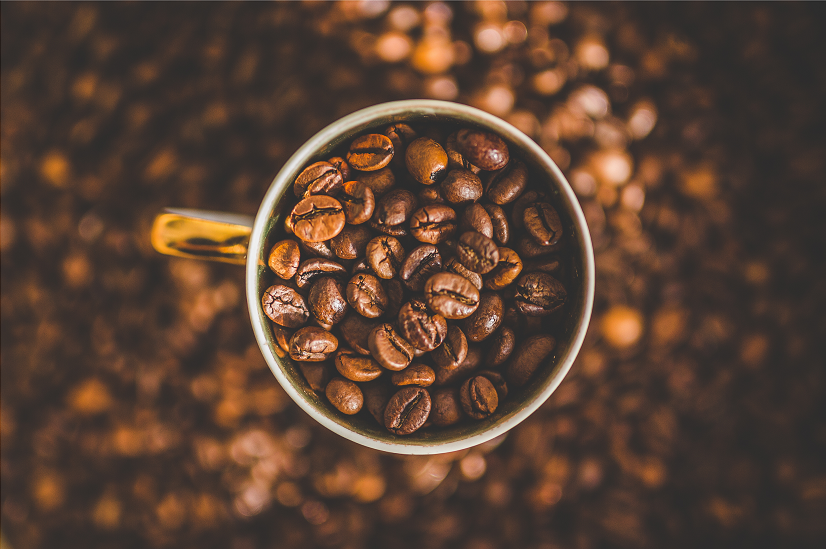
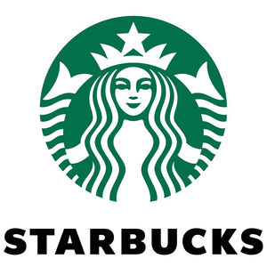
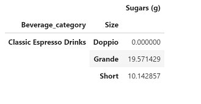
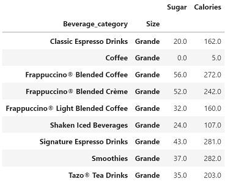
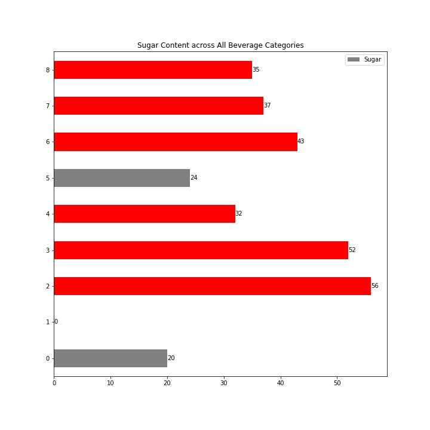
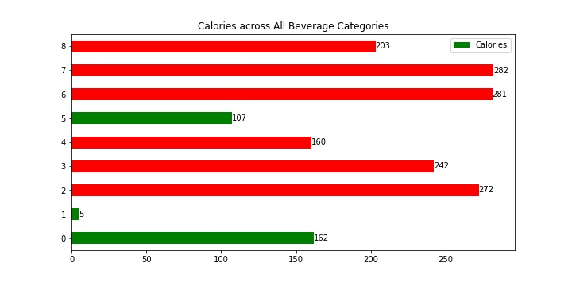

 

# Study on Starbucks Nutrition

We are a small non for profit coffee roastery based in North Carolina. Our coffee has a unique taste, comes in small amounts, and is used in dark roast expresso drinks. We are searching for a successful and long term coffee shop/house that would craft a perfect cup of coffee and make a positive impact in consumers lives. Hence, this project is to study one of our potential partners, the world's largest coffeehouse chain, Starbucks.

We have 2 criterias in selecting our potential partner:
- A partner should be able to craft our coffee within healthy sugar/caloric ranges.

- Committed to ethically sourcing and roasting the highest quality coffee. 

 

# Table of contents
- [Project Title](#project-title)
- [Table of Contents](#table-of-contents)
- [Starbucks's Presence locally and globally](#global-and-local-presence)
- [Who is the average Starbucks customer?](#average-consumer)
- [Starbucks Nutrition](#nutrition)
- [Final Conclusions](#final-conclusion)

# Global and Local Presence
[(Back to top)](#table-of-contents)
Our Analysis showed that Starbucks has # stores across Unites States and # stores globally. We are specifically interested in number of stores in NC and found that there # stores in NC. There are 2 types of ownerships: lincensed and Starbucks owned...

# Average Consumer
[(Back to top)](#table-of-contents)
Lorem ipsum Lorem ipsum Lorem ipsum Lorem ipsum Lorem ipsum Lorem ipsum Lorem ipsum Lorem ipsum Lorem ipsum Lorem ipsum Lorem ipsum Lorem ipsum Lorem ipsum Lorem ipsum Lorem ipsum Lorem ipsum Lorem ipsum Lorem ipsum Lorem ipsum Lorem ipsum Lorem ipsum Lorem ipsum Lorem ipsum Lorem ipsum Lorem ipsum Lorem ipsum Lorem ipsum Lorem ipsum Lorem ipsum 

# Nutrition
[(Back to top)](#table-of-contents)
We had 3 hypotheses:
- The size of the beverages have a positive correlation with the sugar content and calories of the beerage
- 50 of Starbucks drinks will exceed the daily recommended value for Sugar
- Starbucks beverages... Ramya (any thoughts?)
While the analysis showed that most of the espresso drinks have lower than 30 grams of sugar, one of the most eye-opening finding for us was that 71% of Starbucks drinks of all categories of size Grande exceed daily recommended sugar amount which is 30grams/day. 

 

We also looked at the sugar and calories per beverage category of size Grande, which gave us a bigger picture of Starbucks's current beverages and their nutrition values, specifically sugar content and calories which we compared to the daily recommended values.

 

Looking at the below charts we can conclude that the only "healthy coffee drinks" of Grande Size at starbucks are coffee, classic espresso drinks and iced beverages:

 

 

# Final Conclusions 
[(Back to top)](#table-of-contents)
In our final decision, we have taken into careful consideration the nutritional value of the drinks that Starbucks offers to the coffee lovers. 